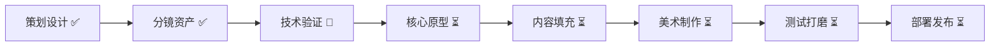

<div align="center">

# 请替我沉默 / Keep Silent For Me

### *你是她没有说出口的那个人。*

[](https://leihuo.163.com/)
[](https://github.com/AvrovaDonz2026/KeepSilentForMe)
[](https://github.com/AvrovaDonz2026/KeepSilentForMe)

**一款约30分钟的语言寄生解谜游戏**

[📖 策划案/组装手册](./schedule.md) • [📝 台本](./台本.md) • [🎨 美术规范](./art-style.md) • [💡 卖点](./selling-points.md) • [🎬 分镜](./storyboard/)

</div>

---

## 📖 项目简介

《请替我沉默》是一款约30-36分钟的短篇叙事解谜游戏。玩家扮演寄生在少女语言里的"消音"，通过唯一的操作——**拖动黑条遮掉句子中的部分文字**——来帮助她在面试、直播、社交等场景中说出"正确"的话。

被遮掉的文字不会消失，而是被你"吃掉"，逐渐在她身边长成你的身体。她靠你的沉默活在社会里，你靠她没说出口的真实想法活下来。

**最新进展**：
- ✅ 完整台词脚本已完成（6章 + 35句台词，台本.md为准）
- 🟡 JSON数据框架就绪（含完整元数据+L0/L1示例，待补全）
- ✅ 关末AI视频转场分镜完成（9-11段视频）
- ✅ 程序/美术组装手册已更新
- 📝 **数据源统一**：台本.md为唯一完整内容源

### 核心特色

- 🎮 **唯一操作**：只能拖黑条遮一段连续文字，机制极简但语义丰富
- 🤝 **共生关系**：操作即关系——保护与控制、陪伴与剥夺同时存在
- 🎨 **独特视觉**：Doomer风格深黑室内 + 哑光黑条生物 + 手绘写实线稿
- 🔄 **认知反转**：结尾揭示——遮住的才是真话，你是唯一听见她的人
- ⚡ **直播友好**：每句话"该遮哪"天然引发讨论，适合传播

## 🎯 游戏信息

| 项目 | 内容 |
|------|------|
| **游戏类型** | 叙事解谜 / 语言操作 / 共生关系 |
| **目标平台** | PC (优先) / Web / 移动端 |
| **预计时长** | 约30-36分钟单周目（含关末视频） |
| **目标受众** | 喜欢《主播女孩重度依赖》式角色关系、短叙事实验的玩家 |
| **开发周期** | 7天竖切版 / 2-3周完整版 |
| **语言** | 中文首发（英文需重做语义设计） |

## 🎮 核心玩法

### 唯一操作：遮字

每次少女准备说话时，屏幕出现一句**完整台词**。玩家只能：

1. 拖动黑条，遮掉句子中的一段连续文字
2. 被遮文字被"吃掉"，进入消音体
3. 剩余文字说出口，决定本关成败

### 示例

原句：`"我当然很高兴你还能回来。"`

| 遮掉 | 说出效果 |
|------|----------|
| "当然" | 变成勉强的欢迎 |
| "很高兴" | 变成冷淡回应 |
| "你还能回来" | 变成没有对象的虚假开心 |
| "我" | 她开始用不属于自己的语气说话 |

## 📚 项目文档

<table>
<tr>
<td width="50%">

### 📋 策划与设计
- **[完整策划案](./schedule.md)** - 游戏设计 + **§十至十六 程序/美术组装手册**
- **[台词脚本](./台本.md)** - **6章35句完整台词（唯一完整源）** + 视频分镜
- **[数据文件](./script/chapters.json)** - JSON框架 + 元数据 + L0/L1示例
- **[卖点分析](./selling-points.md)** - 市场定位、传播策略、slogan库
- **[美术规范](./art-style.md)** - Doomer风格视觉指南

</td>
<td width="50%">

### 🎨 视觉资产
- **[分镜关键帧](./storyboard/frames/)** - 9张关键帧（K1-K9）
- **[场景母版](./storyboard/masters/)** - 房间/街景/道具
- **[迭代版本](./storyboard/)** - v1-dark → v4-prop-lock
- **[效果演示](./请替我沉默-场景Demo与效果.docx)** - 视觉效果展示

</td>
</tr>
</table>

## 🗺️ 游戏结构

### 六章结构

0. **开场（教学）** - 她的第一次呼唤，学习遮字机制
1. **面试** - 让她说出"正确答案"，通过工作面试
2. **第一次直播** - 表演性正确 vs 真实厌恶，维持人设
3. **朋友来访** - 无最优解的两难选择，友谊与秘密
4. **道歉直播** - 舆论压力，消音体开始主动遮挡部分词
5. **没有观众的房间（终局）** - 最后一次遮字即是结局选择

**新增特性**：每章结束后播放AI生成的转场视频（约30秒），展现消音体成长/她的日常/内心状态

### 消音体成长

- **阶段1（萌芽）**：对话框渗出的墨迹，沿桌角蠕动
- **阶段2（半人）**：由碎字组成的半透明轮廓，贴在身侧
- **阶段3（实体）**：几乎与她重叠的模糊人形

## 🎨 美术风格

### 视觉DNA

- **风格**：低饱和深黑层次，手绘2D写实动画线稿
- **色彩**：近黑、蓝黑、脏灰绿，极少量信号红（≤2%）
- **光照**：单点台灯 + 冷窗光，35mm颗粒质感
- **氛围**：安静、疲惫、观察式；不是赛博霓虹或偶像直播

### 参考母版

基于已完成的 doomer-1999 系列视觉资产：
- 深黑室内场景
- 东亚女性侧影与背影
- 雨夜城市湿材质
- 哑光消音条与残字蠕动

## 🛠️ 技术栈

### 已确定方案：Web (HTML5 + CSS + JavaScript)

**选择理由**：
- ✅ **零安装**：浏览器直接运行，无需下载客户端
- ✅ **跨平台**：PC/Mac/移动端统一代码
- ✅ **快速开发**：F5刷新即测试，无构建流程
- ✅ **易分发**：一个URL即可分享游戏
- ✅ **字符热区问题已解决**：DOM + getBoundingClientRect() 精确定位

### 核心技术
- **DOM + CSS**：用 `<span class="zone">` 包裹可遮挡文字，浏览器自动计算位置
- **Pointer Events**：统一处理鼠标和触摸拖拽
- **HTML5 Video**：原生视频播放，支持预加载
- **localStorage**：本地存档（可导出/导入）
- **纯原生JS**：无框架依赖，总代码量约1500-2000行

### 部署方案
- Vercel / Netlify / GitHub Pages（静态托管，免费）
- CDN加速资源加载
- 支持PWA（可添加到主屏幕）

## 📅 开发计划

### 7天竖切版（Web技术栈）

| 天数 | 程序任务 | 美术任务 | 验收标准 |
|------|---------|---------|---------|
| **D0** | HTML结构+zone包裹demo | 测试AI生成V0_out视频 | 拖拽吸附可用 |
| **D1** | JSON加载+完整拖拽+flag系统 | 公寓BG+对话框UI | L0可玩 |
| **D2** | L0+L1全流程+失败重来+视频播放 | 会议室BG+少女姿势+3表情 | L1可通关 |
| **D3** | L2+L3内容+消音体CSS切换 | 门厅BG+Stage素材+剩余表情 | L0-L3连贯 |
| **D4** | L4+L5+结局分支 | Stage3+终局BG+视频V1/V2 | 全章节通 |
| **D5** | 视频集成+反转V_RV+UI抛光 | 视频V3/V4/V5批量生成 | 完整流程 |
| **D6** | localStorage存档+音频+移动端测试 | 收集免费SFX/BGM | 跨设备测试 |
| **D7** | 修bug+部署Vercel/Netlify | 预告截图+宣传素材 | 公开发布 |

### Day 0 技术验证（2小时必做）

在正式开发前验证3个关键技术点：

✅ **验证1：字符热区吸附**
```html
<!-- 测试1句话+3个zone的getBoundingClientRect -->
```

✅ **验证2：AI视频质量** 
```bash
# 用D0首帧生成V0_out测试片
# 检查：脸是否崩/消音体是否长五官/风格是否保持
```

✅ **验证3：移动端兼容**
```bash
# 手机浏览器测试触摸拖拽+视频自动播放
```

### 资产清单（Web优化）

| 类型 | 数量 | 格式建议 | 状态 |
|------|------|---------|------|
| 台词脚本 | 6章35句（每句3-4 zones） | JSON | 🟢 完成 |
| 场景BG | 5张1920×1080 | WebP/JPG (70%质量) | 🟡 待制作 |
| 少女立绘 | 3姿势+8表情 | PNG透明底 | 🟡 待制作 |
| 消音体 | 3阶段 | PNG透明底 | 🟡 待制作 |
| 关末视频 | 9-11条×6-15秒 | MP4 H.264 720p | 🟡 待制作 |
| BGM | 3首 | MP3 128kbps | 🔴 待收集 |
| SFX | 6-8个 | MP3/OGG | 🔴 待收集 |

**总体积预估**：<100MB（视频<80MB，其他<20MB）  
**首屏加载**：<5MB（L0资产+核心代码）

## 🎯 差异化定位

### vs 其他游戏

| 作品 | 我们的不同 |
|------|-----------|
| **普通AVG** | 选项被收成一条黑条；操作本身有身体与成长 |
| **文字解谜游戏** | 改字服务于寄生关系，不是词法玩具 |
| **主播女孩重度依赖** | 更短；机制更极端；黑条人形强符号 |
| **直播模拟经营** | 不做粉丝数；用句子与反应呈现表演压力 |

### 核心卖点

> **她负责说谎，你负责活下来。**

- 操作即关系：遮字不是解谜手段，而是共生行为
- 可传播图像：暗房侧影 + 黑条人形（独特视觉符号）
- 结尾认知反转：遮住的才是真话，你是唯一听见的人

## 🚀 如何开始

### 快速启动（Web版）

```bash
# 1. 克隆仓库
git clone https://github.com/AvrovaDonz2026/KeepSilentForMe.git
cd KeepSilentForMe

# 2. 创建Web项目目录
mkdir web
cd web
mkdir -p assets/{data,bg,char,creature,ui,video,audio/sfx,audio/bgm}
mkdir -p css js

# 3. 拷贝数据文件
cp ../script/chapters.json assets/data/

# 4. 创建index.html（使用schedule.md §11.11的demo）

# 5. 本地运行（解决CORS）
python3 -m http.server 8000
# 访问 http://localhost:8000
```

### 5分钟体验Demo

```bash
# 使用Day 1最小demo（无需任何依赖）
curl -o demo.html https://raw.githubusercontent.com/.../demo.html
open demo.html  # 或双击打开
```

### 部署到生产环境

```bash
# Vercel（推荐，自动HTTPS+CDN）
npm install -g vercel
vercel

# Netlify（拖拽部署）
# 访问 https://app.netlify.com/drop
# 拖入整个文件夹

# GitHub Pages
git push origin main
# 在仓库Settings → Pages启用
```

### 项目结构（Web版）

```
KeepSilentForMe/
├── README.md                    # 项目总览
├── schedule.md                  # 📋 完整策划案（含Web开发指南）
├── 台本.md                      # 📝 35句完整台词
├── script/chapters.json         # 💾 游戏数据
├── art-style.md                 # 🎨 美术规范
├── selling-points.md            # 💡 卖点分析
├── storyboard/                  # 🎬 分镜资产
└── web/                         # 🌐 Web游戏目录
    ├── index.html               # 游戏入口
    ├── css/
    │   ├── style.css
    │   ├── dialogue.css
    │   └── animations.css
    ├── js/
    │   ├── game.js
    │   ├── drag-handler.js
    │   ├── video-player.js
    │   └── save-manager.js
    └── assets/
        ├── data/chapters.json
        ├── bg/                  # 5张场景
        ├── char/                # 立绘+表情
        ├── creature/            # 消音体3阶段
        ├── ui/                  # 对话框+黑条
        ├── video/               # 9-11条视频
        └── audio/               # SFX+BGM
```

## 🤝 团队协作

### 开发角色需求

- [ ] **程序** - 拖拽交互、文本系统、状态机
- [ ] **美术** - 场景绘制、角色立绘、消音体设计
- [ ] **策划** - 台词撰写、分支设计、节奏调优
- [ ] **音频** - BGM、音效、可选配音

### 协作规范

1. 所有台词进入统一JSON表格（id/raw/zones/reactions）
2. 美术资产严格遵循 `art-style.md` 的 doomer 风格
3. 每日同步进度，优先保证核心循环可玩
4. 试玩优先：D6之前必须有内部可玩版本

## 📊 风险与对策

| 风险 | 对策 |
|------|------|
| 玩家以为是普通选词解谜 | 开场30秒内用吞噬动画建立关系 |
| 预设区感觉不自由 | 吸附手感做软；视觉上像自由拖 |
| 语义改写变生硬 | 每句人工写剩余句，不自动拼接 |
| 范围膨胀 | 严格遵守"唯一操作+五关+2-3结局" |
| 主题引争议 | 表达双面性，避免说教 |

## 📊 项目进度



| 阶段 | 状态 | 完成度 | Web技术栈进展 |
|------|------|--------|-------------|
| 📝 策划文档 | ✅ 完成 | 100% | Web开发指南已整合 |
| 📜 台词脚本 | ✅ 完成 | 100% | 35句完整数据 |
| 💾 JSON数据 | ✅ 完成 | 100% | 框架+L0/L1示例完成 |
| 🎨 视觉设计 | ✅ 完成 | 100% | Doomer风格锁定 |
| 🎬 视频分镜 | ✅ 完成 | 100% | 9-11条分镜完成 |
| 💻 技术选型 | ✅ 完成 | 100% | **Web (DOM+CSS)** |
| 🧪 技术验证 | 🔄 待验证 | 0% | Day 0: zone包裹+AI视频 |
| 🎮 核心原型 | ⏳ 待开始 | 0% | Day 1: 拖拽吸附 |
| 📦 资产制作 | ⏳ 待开始 | 0% | BG+立绘+视频 |
| 🎵 音频集成 | ⏳ 待开始 | 0% | 免费资源收集 |
| 🚀 部署上线 | ⏳ 待开始 | 0% | Vercel/Netlify |

## 🎯 关键里程碑

| 里程碑 | 目标日期 | 验收标准 |
|--------|---------|---------|
| **M0: 技术验证** | Day 0 | zone包裹可用 + AI视频测试通过 |
| **M1: 可玩原型** | Day 2 | L0+L1可通关，拖拽流畅 |
| **M2: 内容完整** | Day 4 | 所有章节+结局可玩 |
| **M3: 视频集成** | Day 5 | 9-11条视频全部接入 |
| **M4: Alpha版本** | Day 6 | 存档+音频+跨设备测试通过 |
| **M5: 公开发布** | Day 7 | 部署到公网+预告片完成 |

## 🎯 下一步行动

### 立即可做（Day 0 验证）
- [ ] **创建Day 1 HTML demo**（使用 schedule.md §11.11 模板）
- [ ] **测试zone包裹+拖拽**（验证getBoundingClientRect可用）
- [ ] **生成1条AI视频测试**（V0_out，检查doomer风格）
- [ ] **手机浏览器测试**（触摸拖拽+视频播放）

### 第一周开发（D1-D7）
- [ ] **Day 1**：JSON加载器 + 完整拖拽吸附 + flag系统
- [ ] **Day 2**：L0+L1全流程 + 视频播放器
- [ ] **Day 3-4**：L2-L5所有章节 + 结局分支
- [ ] **Day 5**：视频集成 + 反转效果 + UI抛光
- [ ] **Day 6**：存档系统 + 音频接入 + 移动端优化
- [ ] **Day 7**：测试修bug + 部署上线

### 美术资产（可并行）
- [ ] **场景BG**（5张）：公寓/会议室/直播/门厅/终局
- [ ] **少女立绘**（3姿势+8表情）：基于storyboard/frames/
- [ ] **消音体**（3阶段）：参考D6设计
- [ ] **AI视频**（9-11条）：基于台本.md视频分镜

### 音频资产（Day 6）
- [ ] **SFX收集**（freesound.org）：拖拽/吸附/吃字/生长
- [ ] **BGM选择**（incompetech.com）：3首循环音乐
- [ ] **署名文档**（Credits.txt）：CC-BY授权信息

### 发布准备
- [ ] **部署到Vercel/Netlify**（一键部署）
- [ ] **生成预告视频**（10秒，剪辑关末视频）
- [ ] **准备宣传素材**（截图+GIF+slogan）
- [ ] **提交网易雷火比赛**

## 📜 许可证

TBD - 待网易雷火比赛规则确认

## 🔗 快速链接

<div align="center">

[](https://leihuo.163.com/)
[](./schedule.md)
[](./art-style.md)
[](./selling-points.md)

</div>

---

<div align="center">

**参赛项目**：网易雷火游戏比赛  
**版本**：v0.1 Pre-production  
**最后更新**：2026-07-30

### *"她负责说谎，你负责活下来。"*

Made with ❤️ for NetEase Leihuo Game Jam

</div>
