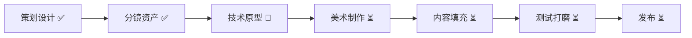

<div align="center">

# 请替我沉默 / Keep Silent For Me

### *你是她没有说出口的那个人。*

[](https://leihuo.163.com/)
[](https://github.com/AvrovaDonz2026/KeepSilentForMe)
[](https://github.com/AvrovaDonz2026/KeepSilentForMe)

**一款约30分钟的语言寄生解谜游戏**

[📖 策划案/组装手册](./schedule.md) • [📝 台本](./台本.md) • [🎨 美术规范](./art-style.md) • [💡 卖点](./selling-points.md) • [🎬 分镜](./storyboard/)

</div>

---

## 📖 项目简介

《请替我沉默》是一款约30-36分钟的短篇叙事解谜游戏。玩家扮演寄生在少女语言里的"消音"，通过唯一的操作——**拖动黑条遮掉句子中的部分文字**——来帮助她在面试、直播、社交等场景中说出"正确"的话。

被遮掉的文字不会消失，而是被你"吃掉"，逐渐在她身边长成你的身体。她靠你的沉默活在社会里，你靠她没说出口的真实想法活下来。

**最新进展**：
- ✅ 完整台词脚本已完成（6章 + 80+句台词）
- ✅ JSON数据结构就绪（程序可直接使用）
- ✅ 关末AI视频转场分镜完成
- ✅ 程序/美术组装手册已更新

### 核心特色

- 🎮 **唯一操作**：只能拖黑条遮一段连续文字，机制极简但语义丰富
- 🤝 **共生关系**：操作即关系——保护与控制、陪伴与剥夺同时存在
- 🎨 **独特视觉**：Doomer风格深黑室内 + 哑光黑条生物 + 手绘写实线稿
- 🔄 **认知反转**：结尾揭示——遮住的才是真话，你是唯一听见她的人
- ⚡ **直播友好**：每句话"该遮哪"天然引发讨论，适合传播

## 🎯 游戏信息

| 项目 | 内容 |
|------|------|
| **游戏类型** | 叙事解谜 / 语言操作 / 共生关系 |
| **目标平台** | PC (优先) / Web / 移动端 |
| **预计时长** | 约30-36分钟单周目（含关末视频） |
| **目标受众** | 喜欢《主播女孩重度依赖》式角色关系、短叙事实验的玩家 |
| **开发周期** | 7天竖切版 / 2-3周完整版 |
| **语言** | 中文首发（英文需重做语义设计） |

## 🎮 核心玩法

### 唯一操作：遮字

每次少女准备说话时，屏幕出现一句**完整台词**。玩家只能：

1. 拖动黑条，遮掉句子中的一段连续文字
2. 被遮文字被"吃掉"，进入消音体
3. 剩余文字说出口，决定本关成败

### 示例

原句：`"我当然很高兴你还能回来。"`

| 遮掉 | 说出效果 |
|------|----------|
| "当然" | 变成勉强的欢迎 |
| "很高兴" | 变成冷淡回应 |
| "你还能回来" | 变成没有对象的虚假开心 |
| "我" | 她开始用不属于自己的语气说话 |

## 📚 项目文档

<table>
<tr>
<td width="50%">

### 📋 策划与设计
- **[完整策划案](./schedule.md)** - 游戏设计 + **§十至十六 程序/美术组装手册**
- **[台词脚本](./台本.md)** - **6章80+句完整台词** + 遮挡区 + 反馈
- **[数据文件](./script/chapters.json)** - **程序唯一内容源（JSON格式）**
- **[卖点分析](./selling-points.md)** - 市场定位、传播策略、slogan库
- **[美术规范](./art-style.md)** - Doomer风格视觉指南

</td>
<td width="50%">

### 🎨 视觉资产
- **[分镜关键帧](./storyboard/frames/)** - 9张关键帧（K1-K9）
- **[场景母版](./storyboard/masters/)** - 房间/街景/道具
- **[迭代版本](./storyboard/)** - v1-dark → v4-prop-lock
- **[效果演示](./请替我沉默-场景Demo与效果.docx)** - 视觉效果展示

</td>
</tr>
</table>

## 🗺️ 游戏结构

### 六章结构

0. **开场（教学）** - 她的第一次呼唤，学习遮字机制
1. **面试** - 让她说出"正确答案"，通过工作面试
2. **第一次直播** - 表演性正确 vs 真实厌恶，维持人设
3. **朋友来访** - 无最优解的两难选择，友谊与秘密
4. **道歉直播** - 舆论压力，消音体开始主动遮挡部分词
5. **没有观众的房间（终局）** - 最后一次遮字即是结局选择

**新增特性**：每章结束后播放AI生成的转场视频（约30秒），展现消音体成长/她的日常/内心状态

### 消音体成长

- **阶段1（萌芽）**：对话框渗出的墨迹，沿桌角蠕动
- **阶段2（半人）**：由碎字组成的半透明轮廓，贴在身侧
- **阶段3（实体）**：几乎与她重叠的模糊人形

## 🎨 美术风格

### 视觉DNA

- **风格**：低饱和深黑层次，手绘2D写实动画线稿
- **色彩**：近黑、蓝黑、脏灰绿，极少量信号红（≤2%）
- **光照**：单点台灯 + 冷窗光，35mm颗粒质感
- **氛围**：安静、疲惫、观察式；不是赛博霓虹或偶像直播

### 参考母版

基于已完成的 doomer-1999 系列视觉资产：
- 深黑室内场景
- 东亚女性侧影与背影
- 雨夜城市湿材质
- 哑光消音条与残字蠕动

## 🛠️ 技术栈

### 推荐引擎
- Unity / Godot / Web (Phaser/Three.js)
- 本质是 UI + 立绘状态机 + 文本分支

### 核心系统
- [x] 拖拽吸附系统（预设3-4个合法zone）
- [x] 句子分支系统（JSON/表格驱动）
- [x] 关卡目标检测
- [x] 消音体三阶段视觉
- [x] 立绘/表情切换
- [x] 简单结局标记

### 不做的系统
- ❌ 好感度/压力值等数值系统
- ❌ 多角色攻略
- ❌ 自由输入/AI对话
- ❌ 地图探索/小游戏
- ❌ 多周目收集/大量结局

## 📅 开发计划

### 7天竖切版

| 天数 | 目标 |
|------|------|
| D1 | 锁定25句文案总表；拖拽吸附原型 |
| D2 | 第一关全流程 + 失败重来；立绘接入 |
| D3 | 第二、三关内容；消音体阶段1-2 |
| D4 | 第四、五关；主动遮挡；结局分支 |
| D5 | 反转表现、UI抛光、音效 |
| D6 | 试玩修改语义、难度、节奏 |
| D7 | 打包、预告片、商店页文案 |

### 资产清单

| 类型 | 数量 | 状态 |
|------|------|------|
| 台词脚本 | 6章80+句（每句3-4个遮挡区） | 🟢 已完成 |
| JSON数据 | chapters.json 完整结构 | 🟢 已完成 |
| 关末视频 | 6段AI视频转场分镜 | 🟢 分镜完成 |
| 场景BG | 5张16:9深黑室内 + 雨夜过场 | 🟡 分镜完成 |
| 少女姿势 | 3-5个（背、侧、半身） | 🟡 参考完成 |
| 表情差分 | 8个微表情 | 🟡 规范完成 |
| 消音体 | 3阶段视觉 | 🟡 概念完成 |
| BGM | 3首（日常压迫/直播/终局） | 🔴 待制作 |
| SFX | 遮挡/吞噬/说出/观众/生长 | 🔴 待制作 |

## 🎯 差异化定位

### vs 其他游戏

| 作品 | 我们的不同 |
|------|-----------|
| **普通AVG** | 选项被收成一条黑条；操作本身有身体与成长 |
| **文字解谜游戏** | 改字服务于寄生关系，不是词法玩具 |
| **主播女孩重度依赖** | 更短；机制更极端；黑条人形强符号 |
| **直播模拟经营** | 不做粉丝数；用句子与反应呈现表演压力 |

### 核心卖点

> **她负责说谎，你负责活下来。**

- 操作即关系：遮字不是解谜手段，而是共生行为
- 可传播图像：暗房侧影 + 黑条人形（独特视觉符号）
- 结尾认知反转：遮住的才是真话，你是唯一听见的人

## 🚀 如何开始

### 环境准备

```bash
# 克隆仓库
git clone https://github.com/AvrovaDonz2026/KeepSilentForMe.git
cd KeepSilentForMe

# 查看项目文档
cat schedule.md      # 完整策划案
cat art-style.md     # 美术风格规范
cat selling-points.md # 卖点与传播策略
```

### 项目结构

```
KeepSilentForMe/
├── README.md                           # 项目总览（本文件）
├── schedule.md                         # 📋 完整策划案（游戏设计文档）
├── art-style.md                        # 🎨 美术风格规范（Doomer视觉指南）
├── selling-points.md                   # 💡 卖点分析（市场定位）
├── 台本.md                             # 📝 台词脚本
├── script/
│   └── chapters.json                   # 章节数据结构
├── storyboard/                         # 🎬 分镜与视觉资产
│   ├── frames/                         # 9个关键帧（K1-K9）
│   ├── frames-2k/                      # 2K高清版本
│   ├── masters/                        # 场景母版（房间/街景/道具）
│   ├── visual/                         # 3x3分镜板
│   ├── prompts/                        # AI生成提示词
│   ├── v1-dark/ ~ v4-prop-lock/        # 迭代版本
│   └── demo-effects/                   # 效果演示
├── 请替我沉默-游戏策划案.docx           # Word版完整文档
└── 请替我沉默-场景Demo与效果.docx       # 场景效果展示
```

## 🤝 团队协作

### 开发角色需求

- [ ] **程序** - 拖拽交互、文本系统、状态机
- [ ] **美术** - 场景绘制、角色立绘、消音体设计
- [ ] **策划** - 台词撰写、分支设计、节奏调优
- [ ] **音频** - BGM、音效、可选配音

### 协作规范

1. 所有台词进入统一JSON表格（id/raw/zones/reactions）
2. 美术资产严格遵循 `art-style.md` 的 doomer 风格
3. 每日同步进度，优先保证核心循环可玩
4. 试玩优先：D6之前必须有内部可玩版本

## 📊 风险与对策

| 风险 | 对策 |
|------|------|
| 玩家以为是普通选词解谜 | 开场30秒内用吞噬动画建立关系 |
| 预设区感觉不自由 | 吸附手感做软；视觉上像自由拖 |
| 语义改写变生硬 | 每句人工写剩余句，不自动拼接 |
| 范围膨胀 | 严格遵守"唯一操作+五关+2-3结局" |
| 主题引争议 | 表达双面性，避免说教 |

## 📊 项目进度



| 阶段 | 状态 | 完成度 |
|------|------|--------|
| 📝 策划文档 | ✅ 完成 | 100% |
| 📜 台词脚本 | ✅ 完成 | 100% |
| 💾 数据结构 | ✅ 完成 | 100% |
| 🎨 视觉设计 | ✅ 完成 | 100% |
| 🎬 视频分镜 | ✅ 完成 | 100% |
| 💻 技术选型 | 🔄 进行中 | 0% |
| 🎮 核心原型 | ⏳ 待开始 | 0% |
| 📦 资产制作 | ⏳ 待开始 | 0% |
| 🎵 音频制作 | ⏳ 待开始 | 0% |

## 🎯 下一步行动

- [ ] **选择开发引擎**（Unity / Godot / Web）推荐Godot或Web
- [ ] **实现拖拽原型**（读取JSON + 黑条吸附 + zone预设）
- [ ] **制作主角立绘**（3-5个姿势 + 8个微表情）
- [ ] **绘制场景BG**（5个主场景 + 雨夜过场）
- [ ] **制作/采购关末视频**（6段转场视频，可用AI生成）
- [ ] **音频制作**（3首BGM + 关键SFX）
- [ ] **第一关通关验证**（L0+L1完整流程测试）

## 📜 许可证

TBD - 待网易雷火比赛规则确认

## 🔗 快速链接

<div align="center">

[](https://leihuo.163.com/)
[](./schedule.md)
[](./art-style.md)
[](./selling-points.md)

</div>

---

<div align="center">

**参赛项目**：网易雷火游戏比赛  
**版本**：v0.1 Pre-production  
**最后更新**：2026-07-30

### *"她负责说谎，你负责活下来。"*

Made with ❤️ for NetEase Leihuo Game Jam

</div>
